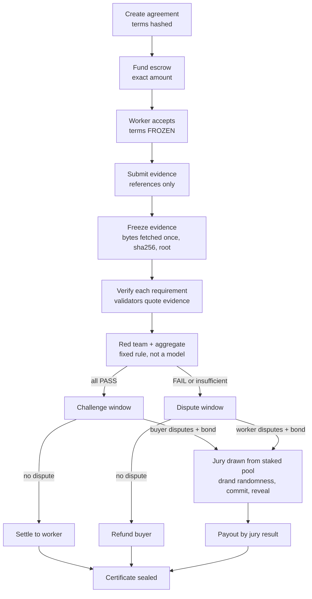

# AgentTrust

**Machine-verifiable agreements for AI-agent work, on GenLayer.**

An agent (or a person) says "I will deliver X". A buyer locks money. Both sides agree on measurable requirements. The worker submits evidence, the evidence is frozen, validators judge each requirement against the frozen evidence and must quote it, an adversarial pass and an auditor can overturn weak passes, and a staked jury can decide disputes. The result is a canonical certificate anyone can re-verify offline.

> AgentTrust checks that a **protocol was followed on frozen evidence**. It does not prove that a deliverable is correct, secure or fit for purpose, and it has **not been audited**. One manual run on GenLayer Studio is documented in [`docs/LIVE_TEST_REPORT.md`](docs/LIVE_TEST_REPORT.md). Read [Limits and non-guarantees](#limits-and-non-guarantees) before using it with anything of value.



## Why GenLayer

The parts that need judgement cannot run in an ordinary contract, and the parts that need money cannot run in an ordinary LLM app. AgentTrust uses GenLayer where it is genuinely required:

* **Validator consensus on web content.** Evidence is fetched by validators with `strict_eq`, so a frozen item exists only if independent validators saw identical bytes.
* **Validator consensus on judgement.** Each requirement verdict uses `run_nondet_unsafe`: the leader's model output is re-validated by every validator (shape, and every quote re-checked), then compared with the validator's own model run on the *categorical verdict only*.
* **Contract-checked model output.** Models propose; the contract verifies quotes as substrings of frozen evidence, derives the overall result by a fixed rule and moves the money.

Take GenLayer away and you would need a trusted server to fetch, judge and pay.

## How it differs from SpecProof and VeriForge

It reuses the proven GenLayer API patterns and lessons from both (see `docs/ARCHITECTURE.md`), but it is a different protocol:

| | SpecProof | VeriForge | AgentTrust |
|---|---|---|---|
| Question | Does the evidence support each declared requirement? | Does a security claim survive adversarial analysis? | Was an agreement between two parties fulfilled, and who gets the money? |
| Money | none | none | escrow, bonds, stakes, pull-payment ledger |
| Parties | one submitter | one submitter | buyer, worker, jurors, anyone |
| Lifecycle | verification pipeline | verification pipeline | 17-state commercial lifecycle with deadlines and defaults |
| Dispute | challenge | challenge | bonded dispute, jury drawn from a pre-registered staked pool with public drand randomness, commit-reveal voting |
| Output | certificate | certificate | certificate that also binds parties, escrow payout and jury result |

## Repository layout

```
contracts/agenttrust.py          the Intelligent Contract (Studio-ready: two header lines, then code)
frontend/                        static site: index.html + assets/ (hash routing, no build step)
scripts/verification/            verify_certificate.py (Python verifier)
scripts/demo/run_demo.py         offline deterministic demo generator
scripts/deploy/                  check_contract.py (lint), build_short_window.py, deploy.mjs (untested)
tests/                           unit, integration, adversarial, security, fuzz, js, frontend, mutation
docs/                            ARCHITECTURE, SECURITY, LIVE_TEST_REPORT, THREAT_MODEL, STATE_MACHINE, VERIFICATION_PROTOCOL,
                                 ESCROW_MODEL, DISPUTE_MODEL, CERTIFICATE_FORMAT, DEPLOYMENT
examples/demo-agreement/         a settled and a jury-refunded certificate with their bundles
.github/workflows/tests.yml      CI
```

## Quick start

Requirements: Python 3.10+ (standard library only), Node 18+ for the JavaScript verifier and its tests. No `pip install` is needed for the contract or the tests.

```bash
# 1. check the contract against the Studio rules (14 rule groups)
python3 scripts/deploy/check_contract.py

# 2. run every test (283 tests, about 20 seconds; the browser test is skipped without Playwright)
python3 -m unittest discover -s tests -t .

# 3. optional: check that the tests catch bugs (53 mutants, several minutes)
python3 tests/mutation_test.py

# 4. optional: browser tests
pip install playwright && playwright install chromium
python3 -m unittest tests.frontend.test_frontend_smoke
```

### Run the frontend locally (offline demo)

```bash
cd frontend && python3 -m http.server 8000
# open http://localhost:8000  (on a phone: http://<your-computer-ip>:8000)
```

The page starts in **Recorded demo** mode: four agreements, one settled, one refunded after a jury vote, one waiting for the worker, one still a draft. No wallet, network or funds are involved, and the page says so.

### Regenerate or check the demo

```bash
python3 scripts/demo/run_demo.py --print      # the timeline of every transaction
python3 scripts/demo/run_demo.py              # rewrite frontend/assets/demo_run.* and examples/demo-agreement/*
python3 scripts/demo/run_demo.py --check      # fails if the committed files differ from a fresh run
```

The demo runs the **real contract code** on the stub SDK with a scripted stand-in for the validators' models, so it demonstrates mechanics and outputs, not real model judgement.

### Verify a certificate

```bash
cd examples/demo-agreement
python3 ../../scripts/verification/verify_certificate.py certificate-settled.json \
    --bundle bundle-settled.json --onchain-hash "$(cat onchain-hash-settled.txt)"
node ../../frontend/assets/verify.js certificate-refunded-after-jury.json \
    --bundle bundle-refunded-after-jury.json --onchain-hash "$(cat onchain-hash-refunded-after-jury.txt)"
```

Both print each check as PASS, FAIL or SKIP and exit non-zero on any FAIL. The **Verify** page of the frontend does the same in the browser, and has a button that tampers with a certificate to show the check failing.

## Deploy to GenLayer Studio

The short version (details, a first live walkthrough and short-window testing are in `docs/DEPLOYMENT.md`):

1. Open GenLayer Studio, create a contract, paste all of `contracts/agenttrust.py`, deploy with no constructor arguments.
2. Copy the contract address.
3. Frontend: open **Settings** on the page, choose **Live**, paste the address, connect a wallet. Or set `contractAddress` and `defaultMode: "live"` in `frontend/assets/config.js`. This is the only value you must insert.

## End-to-end example

`examples/demo-agreement/` holds the artefacts of the offline demo. Agreement `AT-1` (10 GEN, five requirements, adversarial verification):

1. Buyer creates it (`agreement-input.json`), funds exactly 10 GEN, worker accepts: `frozen_hash` now binds the terms.
2. Worker submits three files pinned to commit `2222…`; they are frozen one per call (`evidence-submission.json`): bytes and sha256 are stored, and the last call seals `evidence_root`.
3. Anyone verifies each of the five requirements: every one cites verbatim quotes. The red team finds nothing. `aggregate` derives PASS.
4. The buyer challenges `REQ-002`; the auditor re-reads the same frozen evidence and rejects the challenge.
5. The window closes; `settle` credits the worker 10 GEN; the worker withdraws. The certificate (`certificate-settled.json`) is sealed.

Agreement `AT-2` (4 GEN) shows the other outcomes: one requirement fails, one has no groundable quote so a model's PASS is downgraded to INSUFFICIENT_EVIDENCE, the worker's challenge is rejected, the worker disputes with a bond, three jurors are drawn from the five-member pool with a (simulated) drand round, the jury (two buyer, one worker) decides for the buyer, the two majority jurors share the fee half of the bond, the buyer receives the other half, and the certificate records `BUYER_PREVAILED` with a full refund.

## The pieces, briefly

| Topic | Read |
|---|---|
| How the parts fit | `docs/ARCHITECTURE.md` |
| All 17 states, guards and who may call what | `docs/STATE_MACHINE.md` |
| Evidence freezing, verifier, red team, auditor, aggregation | `docs/VERIFICATION_PROTOCOL.md` |
| Ledger identity, pull payments, payout table | `docs/ESCROW_MODEL.md` |
| Bond, jury selection, commit-reveal, rewards | `docs/DISPUTE_MODEL.md` |
| Certificate fields, hashes and what VALID means | `docs/CERTIFICATE_FORMAT.md` |
| Properties, defences, how it was tested | `docs/SECURITY.md` |
| One manual run on GenLayer Studio | `docs/LIVE_TEST_REPORT.md` |
| Actors, attacks, residual risk | `docs/THREAT_MODEL.md` |
| Studio, frontend config, first live run | `docs/DEPLOYMENT.md` |

## Stalemates never lock funds or reward the loser

Every dispute stage has a deadline that anyone can advance past. If no jury can be seated (`NO_JURY_FALLBACK`: fewer than three eligible jurors in the pool, or nobody seats it in time), or the jury ties or fewer than two jurors reveal (`DEADLOCK_FALLBACK`), the automated consensus result stands: all to the worker on PASS, all back to the buyer otherwise. Non-revealing jurors lose their stake to those who revealed. A dispute nobody attends therefore only delays payment, and it can never earn the losing party a share of the escrow.

## A jury no party can pick

Jurors come from a single staked pool. A dispute can only draw jurors registered **before** it was opened, never its own parties, and the draw uses a **drand** public randomness round that is fixed when the challenge phase starts and unknown until it ends. Registering sockpuppets later, leaving the pool, or filing challenges cannot change who is seated. Half of the dispute bond is a jury fee paid whichever side wins; the other half goes to the winner. Details and limits: `docs/DISPUTE_MODEL.md`.

## Limits and non-guarantees

* **It does not prove the work is correct.** It shows that requirements the parties wrote were judged against evidence that was frozen, by a process that could be challenged.
* **Models can be wrong.** Quotes must exist verbatim, but a quote can be misread. A colluding validator majority defeats consensus. Three drawn jurors can be bribed, and whoever owns a large share of the juror pool is drawn more often.
* **Only frozen evidence counts.** Private repositories, running services and anything not in the evidence cannot be judged. URL evidence is mutable at the source and is flagged as such.
* **Not audited, not formally verified.** Tests are extensive (see `docs/SECURITY.md`) but run against a stub SDK, not GenVM.
* **Run live once, on Studio only.** One run (simple path and a full jury dispute, `text` evidence only) deployed, reached consensus and paid out correctly; see `docs/LIVE_TEST_REPORT.md`. Not yet exercised live: refunds, a buyer-side jury result, non-revealing jurors, challenges, the red team, `github_*` and `url` evidence. Use small amounts.
* **No emergency stop.** The owner can only withdraw the treasury.
* **Frontend live mode is untested against a network** (the offline demo mode and all pages are browser-tested). The `deploy.mjs` script is untested.
* The certificate is not a signature. Authenticity comes from comparing its hash with the one the contract recorded.

## Final self-review

| | Question | Answer |
|---|---|---|
| A | Does the contract load under GenVM? | **Yes, on Studio.** It also passes a 14-rule Studio lint (header, imports, storage types, no `self` in closures, positional `run_nondet_unsafe`, and so on) and loads under the stub. |
| B | Does it deploy? | **Yes, on GenLayer Studio** at about 92 KB (`docs/LIVE_TEST_REPORT.md`). The procedure is in `docs/DEPLOYMENT.md`. |
| C | Do all tests pass? | **Yes.** 283 tests pass; the mutation check kills 52 of 53 mutants, the remaining one documented as equivalent. |
| D | Creation to settlement? | **Yes**, in the stub and in the demo (`AT-1`), including the certificate and withdrawal. |
| E | Can a dispute be created? | **Yes** (`AT-2`): juror pool, bond, beacon-based seating, commit, reveal, finalize, payout. |
| F | Is an invalid challenge rejected? | **Yes.** A challenge whose quote is not verbatim in the frozen evidence is rejected before any model runs; a wrong-side, duplicate, late or out-of-state challenge reverts; a valid-looking challenge the auditor does not uphold is recorded as rejected. |
| G | Are funds released only once? | **Yes.** `escrow_paid` flag, single payout path, ledger identity checked after every step of every test and fuzz run. |
| H | Is evidence actually frozen? | **Yes** by construction (bytes and hash stored once, no rewrite function) and by test. What "frozen" means for `url` items is stated in the certificate. |
| I | Is the certificate independently verifiable? | **Yes.** Two independent verifiers that agree on thousands of corrupted inputs, plus the on-chain hash. |
| J | Does the frontend work on Android/mobile? | **Yes for layout and behaviour**, tested in headless Chromium at phone size (no horizontal scroll, touch-sized controls, no console errors). Not tested on a physical Android device or with a real mobile wallet. |
| K | Does it use GenLayer's unique capabilities? | **Yes**: consensus on fetched web bytes and on model judgement is the core, not decoration. |
| L | Is it meaningfully different from SpecProof and VeriForge? | **Yes**: money, roles, deadlines, a jury and a 17-state lifecycle (table above). |
| M | Any unsupported API or unsafe storage pattern? | **None known.** The escrow API worked on Studio. Storage uses only `str`/`u256`/`DynArray[str]` dataclass fields and class-level `TreeMap`s; the lint enforces no assignment of `TreeMap`/`DynArray` in `__init__`, no `self` in closures, no storage access inside non-deterministic blocks. |

## Credits and licence

MIT, see `LICENSE`. The protocol reuses patterns, lessons and API knowledge from the MIT-licensed SpecProof (evidence-pinned per-requirement verification, canonical certificates) and VeriForge (adversarial roles, frozen evidence, offline verifiers, GenVM lessons) projects, and from the lessons those projects recorded about payable calls. No code was copied blindly: the contract, tests, verifiers and frontend are new.
