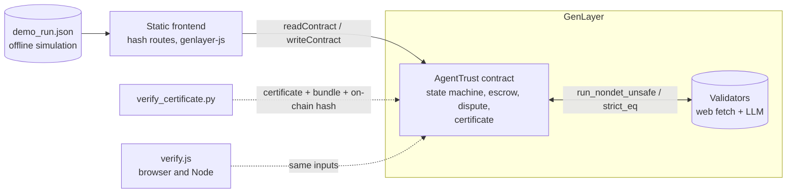
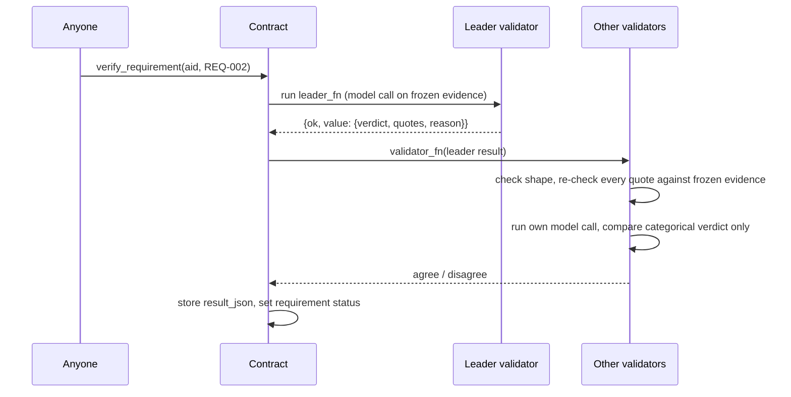

# Architecture

AgentTrust is one GenLayer Intelligent Contract (`contracts/agenttrust.py`), a static frontend, and two independent certificate verifiers. Nothing else is required to run it.

## What lives where

| Part | File | Role |
|---|---|---|
| Contract | `contracts/agenttrust.py` | Everything with authority: state machine, escrow ledger, evidence freezing, verification, challenges, disputes, certificates. Two header lines, then code, no comments (a Studio requirement, checked by `scripts/deploy/check_contract.py`). |
| Offline SDK stub | `tests/genlayer_stub.py` | A small stand-in for the GenLayer SDK surface the contract uses. It is stricter than a naive mock: every validator re-runs its own model call, a validator exception counts as disagreement, and a hook can forge the leader's result. It is not GenVM. |
| Chain harness | `tests/harness.py` | Controllable clock, rollback of reverting transactions, a native-value ledger that also tracks value stuck by reverts, and view-purity checks. |
| Verifiers | `scripts/verification/verify_certificate.py`, `frontend/assets/verify.js` | Two implementations written from `docs/CERTIFICATE_FORMAT.md`, neither imports the contract. `tests/js` proves they agree check by check on thousands of corrupted certificates. |
| Frontend | `frontend/` | Plain HTML, CSS and JavaScript, no build step. Hash routing, a recorded offline demo and a live mode. |
| Demo | `scripts/demo/run_demo.py` | Runs the real contract code on the stub with a scripted model and writes `frontend/assets/demo_run.*` and `examples/demo-agreement/*`. Reproducible byte for byte (`--check`). |

## Contract data model

Records are `@allow_storage @dataclass` types holding only `str`, `u256` and `DynArray[str]` fields, kept in `TreeMap`s keyed by `agreement_id`, `agreement_id|sub_id` or a lowercase address:

`Agreement`, `Requirement`, `EvidenceItem`, `Challenge`, `Dispute`, `Juror` (one seat on one case) and `JurorAccount` (pool membership), plus `balances` (withdrawable), the ledger counters (`total_in`, `total_out`, `escrow_locked`, `stakes_locked`, `bonds_locked`, `claimable_total`, `treasury`), `all_ids` for browsing (appended, never rewritten), `party_index` for per-party lookups without scanning, and `juror_pool` (append-only list of registered jurors).

Structured values (verification results, red-team results, pending evidence) are stored as canonical JSON strings so the exact stored text can be hashed and re-verified.

## The three layers of authority

1. **Contract code** decides everything that can be decided deterministically: who may call what, when, how much money moves, and how per-requirement results combine into an overall result.
2. **Validator consensus** is used only for two kinds of non-deterministic input: fetching evidence bytes (`strict_eq`, byte-exact) and judging one requirement (`run_nondet_unsafe`, comparing only a small categorical key).
3. **Language models** propose verdicts and quotes. They never touch money and cannot make a verdict count without a quote that the contract itself finds verbatim in the frozen evidence.

## Request flow for one verification

## Frontend architecture

`core.js` holds protocol tables, formatting and the two data sources (recorded demo, live contract). `ui.js` holds components including the state-machine SVG. `pages_a.js` and `pages_b.js` render the pages; `app.js` is the router. All chain data is inserted with `textContent`, never as HTML (there is a browser test with a hostile title). Storage is only used for convenience (mode, address, juror salts) and always in `try/catch`.
