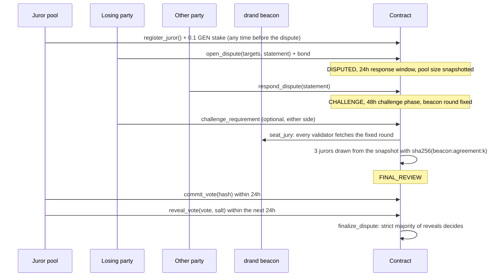

# Dispute model

Disputes are available when the agreement's dispute policy is `JURY`. With policy `NONE` the protocol result is final, and a refund or settlement becomes available as soon as its window closes.

## Who may dispute

Only the party the protocol result went against can open a dispute:

* the buyer, against `VERIFIED_PASS`;
* the worker, against `VERIFIED_FAIL` or `INSUFFICIENT_EVIDENCE`.

This includes `INSUFFICIENT_EVIDENCE` caused by evidence that could not be frozen in time. The disputed requirements must each currently count against the disputer. The disputer attaches a bond of `max(0.1 GEN, amount / 20)`.

## The juror pool

Jurors come from a single pool shared by all agreements.

* **Joining.** Anyone joins with `register_juror` and a stake of exactly 0.1 GEN, once per address.
* **Leaving.** A juror leaves with `request_juror_exit`. The stake can be withdrawn after 96 protocol hours, only after a minimum membership of 720 protocol hours (30 days) from registration, and only when the juror has no open seat. The membership minimum makes padding the pool with throwaway addresses cost locked capital.
* **One stake per seat.** A juror is eligible at seating only if the account holds a full stake for every open seat plus the new one, so a slashed or withdrawn juror is never seated with nothing at risk.
* **Removal.** A seated juror who does not reveal loses the stake and is removed from the pool.

A juror can be drawn for a dispute only if all of these hold:

1. They are not the buyer or the worker of that agreement.
2. They registered strictly before the dispute was opened. Their index is below the `pool_size` recorded by `open_dispute`, and their registration time is earlier than the opening time. The second condition rules out registering in the same second as the dispute.
3. They had not requested an exit, and had not been removed, by the time of the dispute's snapshot.

Condition 3 uses the snapshot time, not the seating time. So leaving the pool after learning the randomness cannot change the draw.

## Drawing the jury

**Fixing the round.** (An upheld challenge that extends the phase moves the round accordingly, so the jury is never public while challenges can still be filed.) `start_challenge_phase` fixes a future round of the drand default beacon (League of Entropy, chain `8990e7a9…`, a round every 30 s). It is the first round published at or after the end of the challenge phase. Nobody knows its value when it is fixed, and no party can change it.

**Seating.** After the challenge phase, anyone calls `seat_jury`:

1. The contract waits until the round has been published for at least 60 seconds.
2. Every validator fetches `https://api.drand.sh/<chain>/public/<round>` under `strict_eq`.
3. Candidates are drawn at pool index `sha256(beacon : agreement_id : k) mod pool_size` for `k = 0, 1, …`, up to 64 draws.
4. Ineligible or repeated candidates are skipped. The first three eligible jurors are seated.
5. The beacon value and round are stored in the dispute record and in the certificate, so anyone can recompute the draw from the public pool.

**No jury.** No jury is seated in these cases:

* the snapshot holds fewer than three jurors;
* 64 draws do not produce three eligible jurors;
* nobody seats the jury within 24 protocol hours of the end of the challenge phase. This bounds how long an unreachable beacon can hold the case.

In each case the bond is returned and the automated protocol result stands (`NO_JURY_FALLBACK`): the full amount goes to the worker if the final verdict is PASS, otherwise it goes back to the buyer. A dispute can never earn the losing party a share of the escrow just because no jury was seated.

**Why this design.** An earlier design used a first-come candidate list per dispute and a seed built from values the parties knew. Our own audit showed two attacks on it:

* A party could fill every candidate slot with its own addresses. The stakes were refunded, so this cost nothing.
* A party could re-roll the seed by filing throwaway challenges.

The pool snapshot and the external beacon close both attacks.

## Commit and reveal

1. **Commit.** Each seated juror first sends `sha256(agreement_id:juror_address:vote:salt)`. The vote is `WORKER` or `BUYER`, and the salt is 8–64 characters. No juror can see another's vote before committing.
2. **Reveal.** After the commit window closes, jurors reveal their vote and salt, and the contract recomputes the hash.

The frontend helps jurors reveal correctly:

* it remembers the committed vote, salt and hash in browser storage when storage is available;
* it pre-selects the committed vote;
* it refuses to send a reveal that does not match the commitment.

## Result

`finalize_dispute` runs when every seated juror has revealed, or when the reveal window has closed. With `n` reveals, `rw` of them for the worker and `rb` for the buyer:

| Condition | Result | Escrow |
|---|---|---|
| `n < 2` | `DEADLOCK_FALLBACK` | automated result stands |
| `rw · 2 > n` | `WORKER_PREVAILED` | all to worker |
| `rb · 2 > n` | `BUYER_PREVAILED` | all to buyer |
| tie | `DEADLOCK_FALLBACK` | automated result stands |

The "automated result" is the final protocol verdict, including any challenges upheld during the challenge phase.

## The bond, the fee and stakes

The bond is split into two halves:

* the **jury fee**, `bond // 2`;
* the **collateral**, the rest of the bond.

| Party | Decisive result | Deadlock (jury seated) | No jury |
|---|---|---|---|
| Majority jurors | share fee plus forfeited stakes | — | — |
| Jurors who revealed | stake stays in the pool | share fee plus forfeited stakes | — |
| Jurors who did not reveal | lose their stake and are removed from the pool | lose their stake and are removed from the pool | — |
| Disputer who won | collateral back | collateral back | whole bond back |
| Disputer who lost | collateral goes to the other party | — | — |
| Deadlock with nobody revealing | — | disputer gets the whole bond back; forfeited stakes go to the treasury | — |

These rules fix three incentive problems:

* **Paid either way.** Jurors are paid the fee whichever side wins. This removes the earlier bias, where voting against the disputer was the only way to earn anything.
* **Losing costs the loser.** A losing disputer's collateral compensates the other party for the delay.
* **Silence is costly.** Not revealing costs the stake.

Integer-division dust, and forfeited stakes with no eligible recipient, go to the treasury. Only the owner can withdraw the treasury, and it is used for nothing else.

## Limits, stated plainly

* **Pool capture.** A party that registers a large share of the whole pool before a dispute is drawn proportionally more often. The pool snapshot and the unpredictable beacon remove the cheap, certain attacks (slot filling and seed grinding), but the defence against a patient, well-funded Sybil is economic, not absolute.
* **The beacon is external.** The contract checks the beacon round number and the format of its value. It cannot verify drand's BLS signature on GenVM. Trust rests on the League of Entropy and on every validator fetching the same value. Anyone can check the recorded value against drand's public API afterwards.
* **Bribery.** Three jurors can be bribed once they are known. Commit-reveal hides votes, not identities.
* **Bond size.** The disputer's bond is small relative to a large escrow (5%). Raising it is a parameter change in a new deployment.
* **Lost salts.** A juror who commits and then cannot reveal, for example because the salt was lost, loses the stake. That is by design, but it is harsh on honest mistakes.
* **Juror error.** Jurors decide from the same frozen evidence and recorded records. Nothing prevents them from being wrong.
