# State machine

There are 17 states. The transition table is one dictionary in the contract (`ALLOWED_EDGES`), enforced by a single function (`_enter`) that every transition goes through. A unit test compares the table with the copy below, and a stateful fuzzer asserts after every random call that no transition outside it ever happened and that terminal states never change.

```mermaid
stateDiagram-v2
  [*] --> CREATED
  CREATED --> FUNDED: fund (buyer, exact amount)
  CREATED --> CANCELLED: cancel (buyer)
  FUNDED --> ACCEPTED: accept (worker)
  FUNDED --> REFUNDED: cancel (buyer)
  FUNDED --> TIMEOUT: expire_if_timed_out
  ACCEPTED --> IN_PROGRESS: start_work (worker)
  ACCEPTED --> TIMEOUT: expire_if_timed_out
  IN_PROGRESS --> DELIVERED: submit_deliverable (worker)
  IN_PROGRESS --> TIMEOUT: expire_if_timed_out
  DELIVERED --> VERIFICATION_PENDING: freeze_evidence (party)
  DELIVERED --> INSUFFICIENT_EVIDENCE: expire_if_timed_out (not fully frozen; worker may dispute)
  VERIFICATION_PENDING --> VERIFIED_PASS: aggregate
  VERIFICATION_PENDING --> VERIFIED_FAIL: aggregate
  VERIFICATION_PENDING --> INSUFFICIENT_EVIDENCE: aggregate
  VERIFIED_PASS --> SETTLED: settle (after window)
  VERIFIED_PASS --> VERIFIED_FAIL: challenge upheld
  VERIFIED_PASS --> INSUFFICIENT_EVIDENCE: challenge upheld
  VERIFIED_PASS --> DISPUTED: open_dispute (buyer + bond)
  VERIFIED_FAIL --> DISPUTED: open_dispute (worker + bond)
  VERIFIED_FAIL --> REFUNDED: claim_refund (buyer)
  INSUFFICIENT_EVIDENCE --> DISPUTED: open_dispute (worker + bond)
  INSUFFICIENT_EVIDENCE --> REFUNDED: claim_refund (buyer)
  DISPUTED --> CHALLENGE: start_challenge_phase
  CHALLENGE --> FINAL_REVIEW: seat_jury (3 drawn from the pool)
  CHALLENGE --> FINALIZED: seat_jury (fewer than 3)
  FINAL_REVIEW --> FINALIZED: finalize_dispute
  TIMEOUT --> REFUNDED: claim_refund (buyer)
  SETTLED --> [*]
  FINALIZED --> [*]
  REFUNDED --> [*]
  CANCELLED --> [*]
```

## Draft, committed, frozen

| Level | Status | What is fixed | What is still open |
|---|---|---|---|
| Draft | `CREATED` | Terms and policies are hashed into `agreement_hash` at creation. There is no edit function, so the terms cannot change even now. | Nobody is bound. The buyer can cancel. |
| Committed | `FUNDED` | Escrow is locked. | The worker has not agreed. The buyer can still cancel for a refund. |
| Frozen | `ACCEPTED` onward | `frozen_hash = sha256(agreement_hash, accepted_at, worker)`. | Nothing about the terms. |

Evidence has its own three levels: **referenced** (`DELIVERED`: only a list of references, nothing fetched), **frozen** (`freeze_evidence`, one item per call: exact bytes and sha256 stored; the last call seals `evidence_root`) and, for `url` items only under the `PERMISSIVE` policy, **frozen content from a mutable source** (the stored bytes never change but the page they came from might, and the certificate says so).

## Transition guards

Every write function starts with the same pattern: fetch the record, check the caller's role (`_only`), check the status (`_need`), check the time (`_before`, or an explicit comparison), then mutate. Payable functions never revert after receiving value (see `ESCROW_MODEL.md`).

| Function | Caller | Required status | Time rule |
|---|---|---|---|
| `create_agreement` | anyone (becomes buyer) | none | deadline between 1 hour and 1 year |
| `fund` | buyer | `CREATED` | before deadline; value must equal amount exactly |
| `cancel` | buyer | `CREATED`, `FUNDED` | any |
| `accept`, `start_work`, `submit_deliverable` | worker | `FUNDED`, `ACCEPTED`, `IN_PROGRESS` | before deadline |
| `freeze_evidence` | buyer or worker | `DELIVERED` | within 24 protocol hours of delivery; freezes the next item, the last one moves to `VERIFICATION_PENDING` |
| `verify_requirement`, `red_team_requirement` | anyone | `VERIFICATION_PENDING` | within the verify window |
| `aggregate` | anyone | `VERIFICATION_PENDING` | needs all requirements judged, or the window over (missing ones become insufficient) |
| `challenge_requirement` | buyer (on pass), either party (in `CHALLENGE`) | `VERIFIED_PASS`, `CHALLENGE` | before the stage deadline; an upheld challenge in `CHALLENGE` extends the phase to at least 24 protocol hours from then |
| `open_dispute` | the losing party | `VERIFIED_PASS`, `VERIFIED_FAIL`, `INSUFFICIENT_EVIDENCE` | before the window closes; exact bond |
| `respond_dispute` | the other party | `DISPUTED` | before the response deadline |
| `register_juror` / `request_juror_exit` / `withdraw_juror_stake` | anyone (pool membership, not tied to an agreement) | none | exact stake; withdrawal 96 protocol hours after the exit request, 30 days after registration, and with no open seat |
| `start_challenge_phase` | anyone | `DISPUTED` | after the response window; fixes the drand round |
| `seat_jury` | anyone | `CHALLENGE` | after the challenge phase and at least 60 s after the drand round is published; after a 24 protocol hour grace period it finalizes with the automated result instead |
| `commit_vote` / `reveal_vote` | seated jurors | `FINAL_REVIEW` | before the commit deadline / between commit and reveal deadlines |
| `finalize_dispute` | anyone | `FINAL_REVIEW` | when all revealed, or after the reveal deadline |
| `settle` | anyone | `VERIFIED_PASS` | after the challenge window |
| `claim_refund` | buyer | `TIMEOUT`, `VERIFIED_FAIL`, `INSUFFICIENT_EVIDENCE` | after the dispute window (immediately when the dispute policy is `NONE` or the state is `TIMEOUT`) |
| `expire_if_timed_out` | anyone | `FUNDED`, `ACCEPTED`, `IN_PROGRESS`, `DELIVERED`, `VERIFICATION_PENDING` | only when a deadline has actually passed |

A protocol hour is 3600 seconds (`WINDOW_UNIT`). `scripts/deploy/build_short_window.py` builds a copy with shorter units for live testing only.
